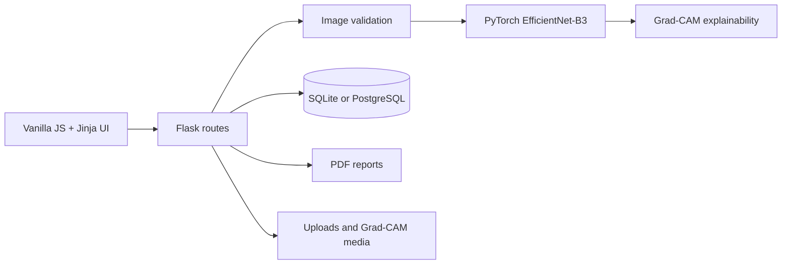

# AnemiaVision AI

> Hospital-grade anemia screening powered by EfficientNet-B3 deep learning plus Grad-CAM explainability.


## Live Demo

- Vercel UI demo: https://anemia-detection-kru8.vercel.app/
- Note: the Vercel demo serves the lightweight frontend because PyTorch inference exceeds Vercel Lambda storage limits. Use the Docker/Render deployment for full AI prediction.


## What's New (UI v2.0)

- Complete UI redesign with a glassmorphism dark medical theme
- Animated particle background, floating orbs, cursor glow, and page transitions
- Drag-and-drop image upload with live preview and local image quality hints
- Mobile-first camera capture workflow with rear-camera preference
- Animated Grad-CAM comparison slider on result pages
- Redesigned analytics dashboard with Chart.js dark-mode charts
- Modern history grid/list toggle with filters, confidence bars, and CSV export
- Full IntersectionObserver scroll animations and animated counters

## Quick Start

```bash
python -m venv .venv
.venv\Scripts\activate
pip install -r requirements.txt
python app.py
```

Open `http://127.0.0.1:5000`.

To validate the dataset before training:

```bash
python utils/check_dataset.py
```

To run with Docker:

```bash
docker compose up --build
```

## Screenshots

- Home page screenshot placeholder
- Scan workflow screenshot placeholder
- Result and Grad-CAM comparison screenshot placeholder
- History dashboard screenshot placeholder
- Analytics dashboard screenshot placeholder

## How It Works

1. Capture or upload a smartphone image of the eye conjunctiva or fingernail.
2. Validate image quality and reject unsupported formats.
3. Run the EfficientNet classifier and calibrated probability pipeline.
4. Generate a Grad-CAM overlay to show the AI focus region.
5. Save the scan, display risk guidance, and export a PDF report.

Dataset folders are discovered flexibly across common class naming variants:

```text
dataset/
├── train/
│   ├── anemic/
│   └── non-anemic/
├── valid/
│   ├── Anemia/
│   └── Non_Anemia/
└── test/
    ├── Anemic/
    └── Non-anemic/
```

## Architecture



## Training

Start a fresh training run:

```bash
python train.py
```

Resume from a checkpoint:

```bash
python train.py --resume models/last_checkpoint.pth
```

Evaluate the trained model:

```bash
python evaluate.py --split test
```

Artifacts are saved under `models/` and `logs/`.

## API Reference

### `POST /api/predict`

JSON request:

```json
{
  "image": "<base64-image-or-data-uri>",
  "patient_name": "Aarav Kumar",
  "age": 25,
  "gender": "Male",
  "phone": "9999999999",
  "image_type": "Eye Conjunctiva",
  "notes": "Fatigue for 2 weeks"
}
```

Success response:

```json
{
  "success": true,
  "scan_id": 42,
  "public_scan_id": "AV-000042",
  "prediction": "Non-Anemic",
  "confidence": 0.912,
  "risk_level": "Low Risk",
  "gradcam_url": "/media/gradcam/scan_042.jpg",
  "result_url": "/result/42",
  "pdf_url": "/export/pdf/42"
}
```

Notes:

- Base64 payloads may be raw strings or data URIs.
- Prediction endpoints are rate-limited per IP.
- Uploads are optimized before inference and storage.

## Tech Stack

| Layer | Technology |
|-------|------------|
| Frontend | Vanilla JS, CSS3, Chart.js |
| Backend | Flask, Gunicorn |
| AI Model | PyTorch, torchvision, EfficientNet-B3 |
| Database | SQLite / PostgreSQL |
| Reports | ReportLab |
| Deployment | Docker, Render, Vercel entrypoint |

## Deployment

### Render

Use `render.yaml` to provision the web service and Postgres database. For persistent media and reports, attach a disk and set:

```text
ANEMIA_RUNTIME_ROOT=/var/data/anemiavision
DATABASE_URL=<postgres connection string>
FLASK_SECRET_KEY=<long random secret>
```

### Vercel

The repository includes `api/index.py` and `vercel.json` for the Flask serverless entrypoint. Set `DATABASE_URL` to managed Postgres for durable patient rows. Serverless disk is not durable, so use Render/Fly/Railway or object storage for persistent uploads and Grad-CAM files.

### Production Command

```bash
gunicorn --bind 0.0.0.0:5000 --workers 2 app:app
```

Health check:

```text
GET /health
```

## Disclaimer

AnemiaVision AI is for screening assistance only. It is not a clinical diagnostic tool and does not replace professional medical evaluation, CBC testing, or physician judgment.
